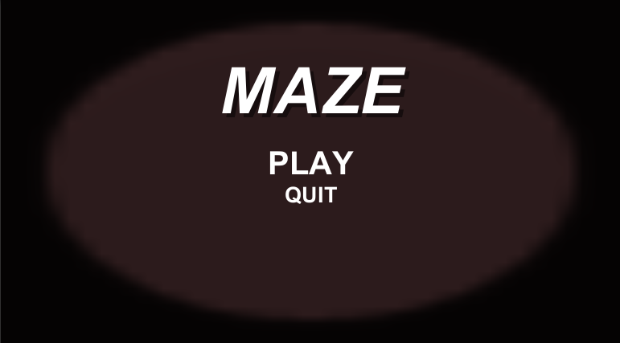
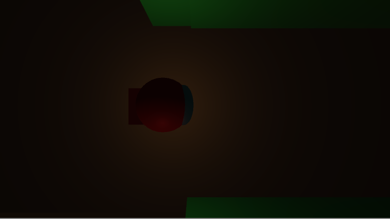
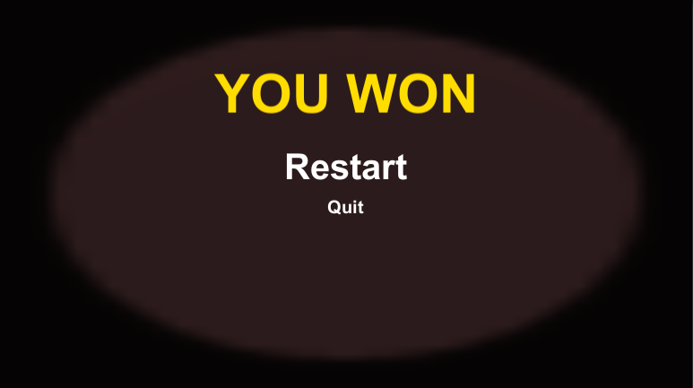

| Nicholas Jordan|
| :---          	|
| s208047     	|
| Cross Platform |
| Maze Documentation |

## I. Design

The game consist of three scenes that lead the player through the game.

This is the first scene of the game. The start menue that diplays the name of the game and two buttons: Play, Quit. 

This is the second scene of the game. This is where the player makes their way through the maze to the goal 
using the mouse to navigate.
While in this scene, the player can press ESC to pause the game and open a game menu that gives the option to resume or quit. 

This is the last scene of the game. Because there is no loosing it says you won and 
gives the player the option to restart or quit the application.

### Object Information

**File**: MainMenu.cs

**Attributes**

        Name: PlayGame() 
            Description: gives function to the play button that loads the next scene
            Type: void

        Name: QuitGame() 
            Description: gives function to the quit button that closes the application
            Type: void

**File**: PlayerMovement.cs

**Attributes**

        Name: canBeClicked 
            Description: specifies what layer to take input from when clicking the mouse
            Type: LayerMask

        Name: agent 
            Description: holds reference to a specific nav mesh agent 
            Type: NavMeshAgent

        Name: Start() 
            Description: Start is called before the first frame update 
            Type: void

        Name: Update() 
            Description: Update is called once per frame 
            Type: void

**File**: CameraFollow.cs

**Attributes**

        Name: cameraDistOffset 
            Description: how much the camera will offset from the specified value
            Type: flaot

        Name: mainCamera 
            Description: holds referance to given camera
            Type: camera

        Name: player 
            Description: holds referance to a specified object
            Type: gameObject

        Name: Start() 
            Description: Start is called before the first frame update 
            Type: void

        Name: Update() 
            Description: Update is called once per frame 
            Type: void

**File**: PauseMenu.cs

**Attributes**

        Name: gamePaused 
            Description: Set to declare if the game is paused or not
            Type: bool

        Name: pauseMenuUI 
            Description: holds a refrence to whatever gameObject this file gets attached to 
            Type: gameObject

        Name: Update() 
            Description: Update is called one per frame
            Type: void

        Name: Resume() 
            Description: creates function to the resume button that unpauses the game and clears the pause menu 
            Type: void

        Name: Pause() 
            Description: Pauses the game and shows the pause menu
            Type: void

        Name: QuitGame() 
            Description: creates function to the quit button that closes the application
            Type: void

**File**: GoalCollider.cs

**Attributes**

        Name: OnTriggerEnter(Collider other) 
            Description: detects collision with the player and loads the next scene or end scene
            Type: void

**File**: WinMenu.cs

**Attributes**

        Name: Restart() 
            Description: Gives function to the restart button by setting the scene back one to the game scene
            Type: void

        Name: QuitGame() 
            Description: creates function to the quit button that closes the application
            Type: void